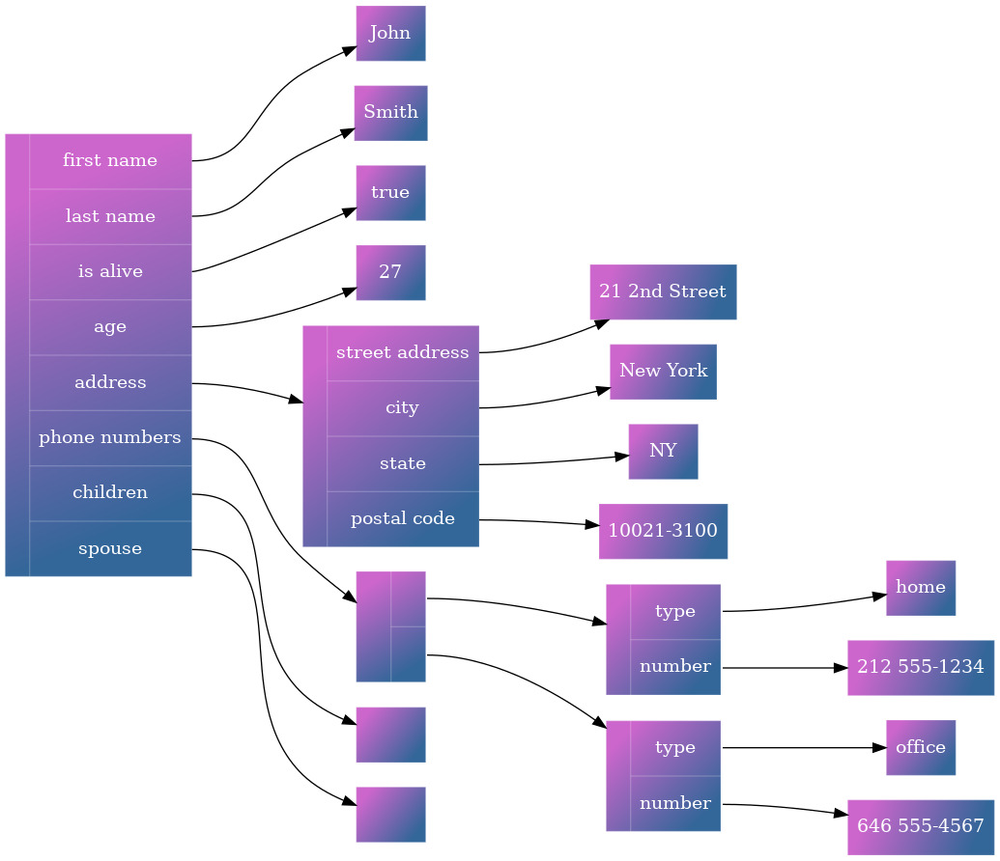
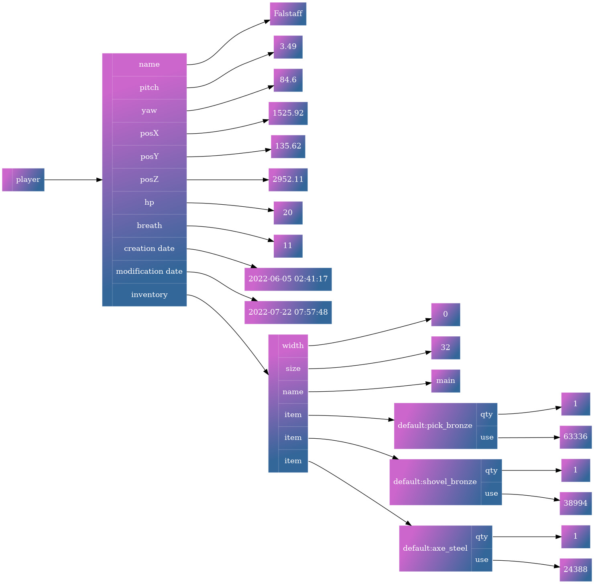

# Jevko examples by [kragen](http://canonical.org/~kragen/)

The examples in this directory were created by [kragen](http://canonical.org/~kragen/) and placed in the public domain (as stated in [this comment](https://news.ycombinator.com/item?id=33352544)).

The diagrams were generated from *.dot sources which are included.

In these examples Jevko is used as:

> A minimal Unicode syntax for ordered trees with labeled nodes and labeled arcs.

The diagrams treat leading and trailing whitespace on arc labels (prefixes), as well as suffixes consisting only of whitespace as insignificant.

## johnsmith.jevko

This example was derived from [information on Wikipedia](https://en.wikipedia.org/wiki/JSON#Syntax).

Jevko source: [johnsmith.jevko](johnsmith.jevko)

Visualized as a diagram:

Diagram source: [johnsmith.dot](johnsmith.dot)

## horse.jevko

This example was derived from [information on Wikipedia](https://en.wikipedia.org/wiki/Horse).

See also a [related example](../wikipedia.md).

Jevko source: [horse.jevko](horse.jevko)

Visualized as a diagram:

Diagram source: [horse.dot](horse.dot)

## player.jevko

> based on Minetest's relational database schema, recast as a hierarchical schema. It also takes advantage of the ordered nature of subJevkos, the possibility of multiple identical prefixes in the same parent node, and the possibility of having both "headers" (subJevkos) and a "body" (suffix) in the same node.

Jevko source: [player.jevko](player.jevko)

Visualized as a diagram:

Diagram source: [player.dot](player.dot)
